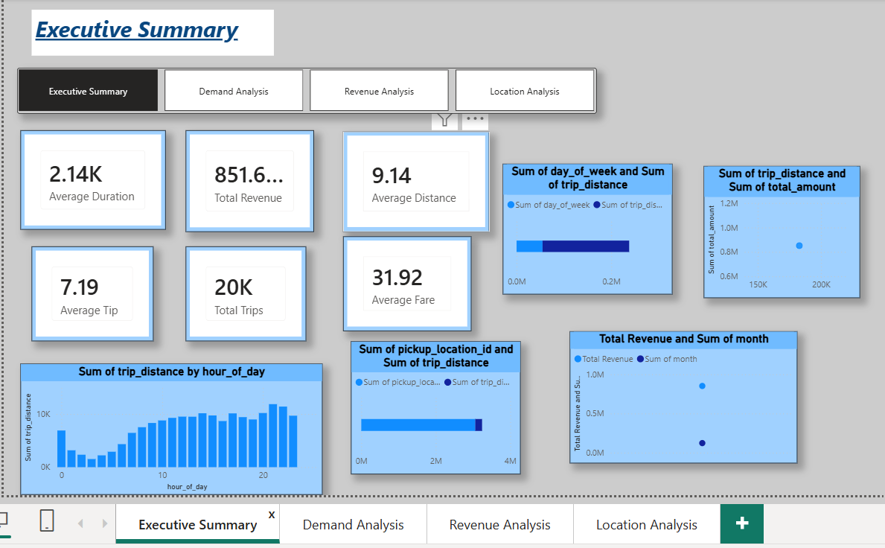
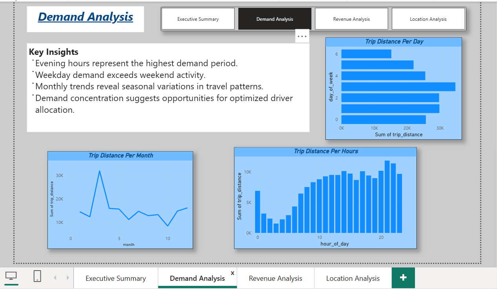
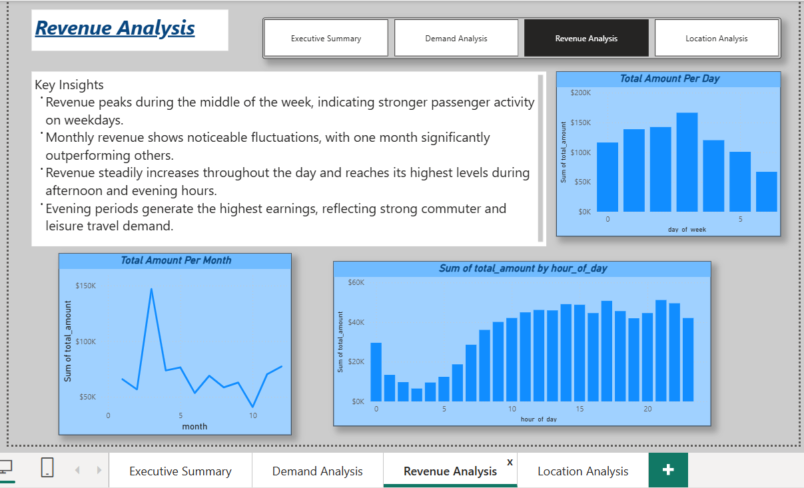
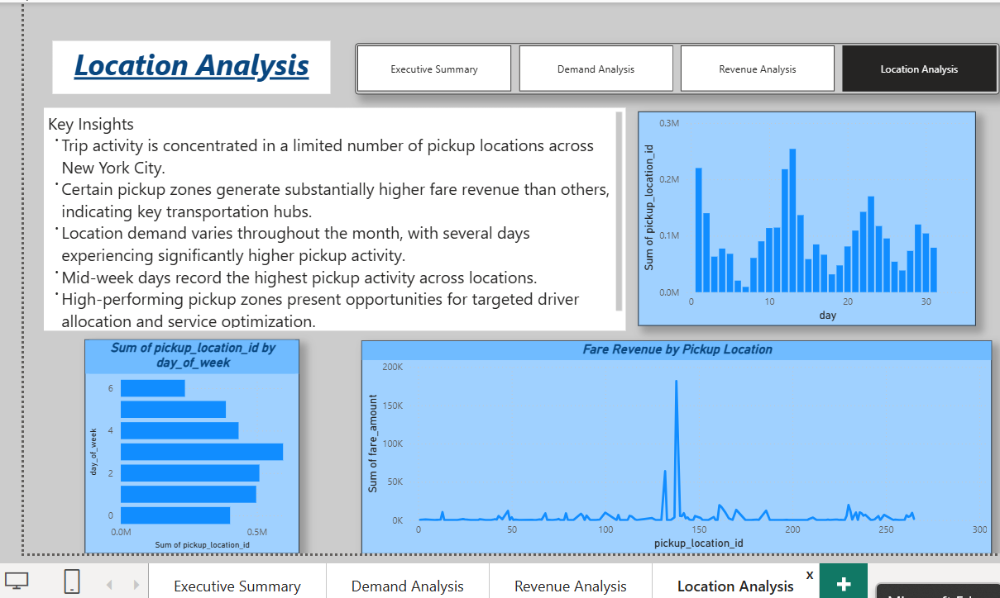

#  New York City Taxi Trip Analysis Dashboard

## Project Overview

This project analyzes New York City taxi trip data using SQL and Power BI to uncover demand patterns, revenue trends, and location-based insights.

## Tools Used

- SQL
- Power BI
- Data Analysis
- Data Visualization

## Dashboard Pages

### Executive Summary
Provides an overview of trips, revenue, fare, distance, and tipping behavior.

### Demand Analysis
Analyzes trip demand by month, day of week, and hour of day.

### Revenue Analysis
Examines revenue performance across different time periods.

### Location Analysis
Identifies high-demand pickup locations and transportation hubs.

## Key Insights

- Generated over $851K in total revenue from 20K trips.
- Evening hours recorded the highest demand.
- Revenue varied across weekdays and months.
- Trip activity was concentrated in key pickup locations.
- Customer tips contributed significantly to driver earnings.

## Dashboard Screenshots

### Executive Summary

### Demand Analysis

### Revenue Analysis

### Location Analysis

## Author

Meenakshi Sharma
